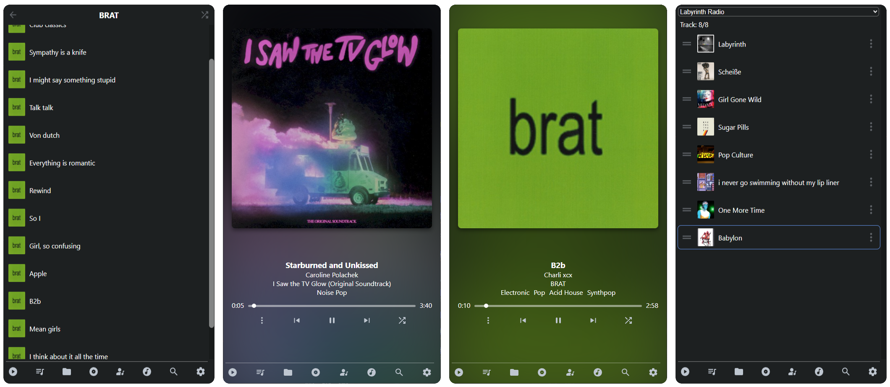

# TrackFish

This is a music player, made for offline usage while not having to sacrifice online features.

It works just as well as any other music player would (apart from a big lacking in settings/search right now), but the main feature of it is the radio system.

Using tags on your mp3/wav/other files (which you may need to tag using picard/onetagger/yourself), the application weights songs by how "close" they are to one another, so your massive music collection doesn't leave you skipping over and over again as you try to get to certain songs.

# Features
- Track view and playback
- Explorer screens for artists, albums, genres and more!
- Queues for the above categories and basic queue management
- Autoplay System

# To Do:
- Proper Album & Artist Views
- Autoplaylists (implemented on the backend just need UI)
- More View Information (time, artists, etc)
- Comprehensive Settings
- Exceptions for albums, artists from shuffle
- View Settings
- More Weighting
- Theming
- More Queue Management
